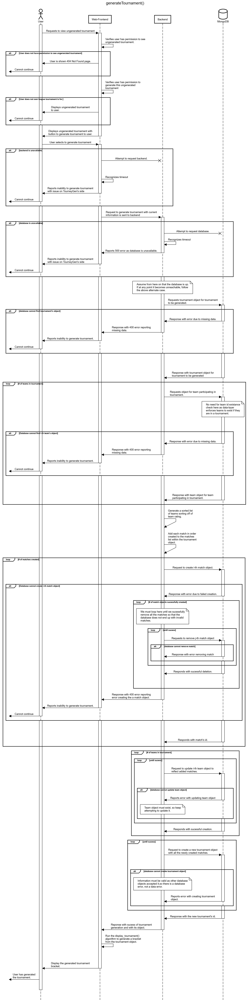

# Milestone 2: Detailed Design Document
## Team 3-9: TourneyGen

<h4>
Jordan Snadberg V00871232  
Landon Marshall V00843849  
Ross Alexandra V00  
Ethan Kwam V00

# 1 Introduction
This section will provide a problem statement, give an overview of the functionality of the application, and specify any constraints.
## 1.1 Problem
Currently, there lacks an intuitive method for competitive leagues to organize themselves into groups and keep track of skill level while playing against each other in tournaments. Although there are existing products which allow you to create brackets for single tournaments (ex. [Tournament Bracket Generator](https://challonge.com/tournament/bracket_generator)), there is currently no software which organizes entire leagues.
## 1.2 Overview
The goal of TourneyGen is to allow leagues to organize and manage themselves. TourneyGen will provide an overarching structure to individual tournaments, allowing leagues to keep track of multiple competitive tournaments within that league. The application will have three main components for users to interact with: leagues, teams, and tournaments.The app is laid out in a hierarchical structure with a league being at the top of the hierarchy and teams residing underneath a league. Once a league contains multiple teams, tournaments can be held within a given league. The additional functionality of ranking is provided. The application uses the Elo ranking system to rank teams appropriately. This system uses statistics to assign values to you and your opponent. If a user wins a game against a strong opponent they experience a large gain in rank and their opponent experience a large loss of rank. If a user wins a game against a weaker opponent both of user experience very little difference in rank. This ranking help keep matches fair and allow for rank movement. --can someone explain elo here--  [3].

# 2 Sequence Diagram
<br\>

